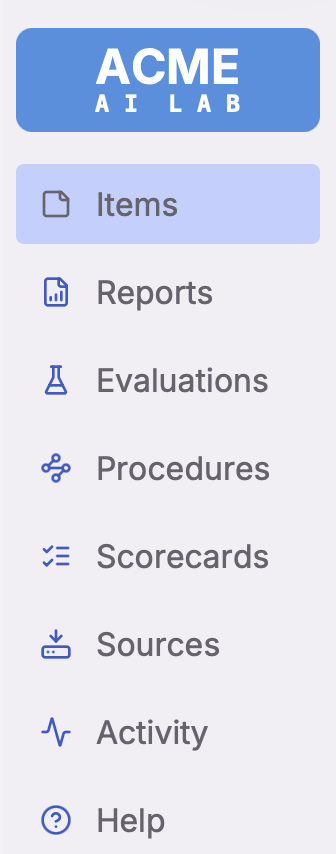

# Plexus Branding

This repository contains white-label branding packages for Plexus dashboard deployments.



## About White-Label Branding

The Plexus dashboard supports complete white-labeling, allowing you to customize the logo, colors, and fonts without modifying the core [Plexus](https://github.com/AnthusAI/Plexus) codebase. Brand assets are maintained in separate repositories and bundled during deployment.

**Key Features:**
- Custom React logo components with multiple variants (Square, Wide, Narrow)
- Color palette overrides using Radix color system
- Font customization
- Build-time asset bundling for production
- Same-origin security for dynamic component loading

**Documentation:**
- [Complete White-Labeling Guide](https://github.com/AnthusAI/Plexus/blob/main/dashboard/BRANDING.md) - Detailed instructions in the main Plexus repository
- This repository serves as a reference implementation

## Structure

Each brand package is a directory containing:
- `brand.json` - Configuration file specifying brand name and asset paths
- `logo.js` - Custom logo component (ES module) with support for Square, Wide, and Narrow variants
- `styles.css` - CSS variable overrides for colors and fonts using Radix color system
- `images/` - Brand assets (logos, screenshots, etc.)

## Example Brand: ACME AI Lab

The `example/` directory contains a complete reference implementation demonstrating:
- **Custom two-line logo** with "ACME" and "AI LAB" subtitle
- **Professional color palette**: Indigo (primary), Amber (secondary), Cyan (accent)
- **Three logo variants**: Square, Wide, and Narrow for different layout contexts
- **Conservative Midwest aesthetic**: Clean, flat design without shadows or gradients
- **Proper light/dark mode support**: Uses Radix color aliasing for consistent contrast

Use this as a template for creating your own brand packages.

## Usage

Set the environment variable in your Plexus deployment:

```bash
NEXT_PUBLIC_BRAND_CONFIG_URL=/brands/example/brand.json
```

## Development

For local development, symlink this repository into the Plexus dashboard public directory:

```bash
ln -s /Users/ryan.porter/Projects/Plexus-branding /Users/ryan.porter/Projects/Plexus/dashboard/public/brands
```

## Production Deployment

Deploy the contents of this repository to your web server's public directory at the `/brands/` path.

